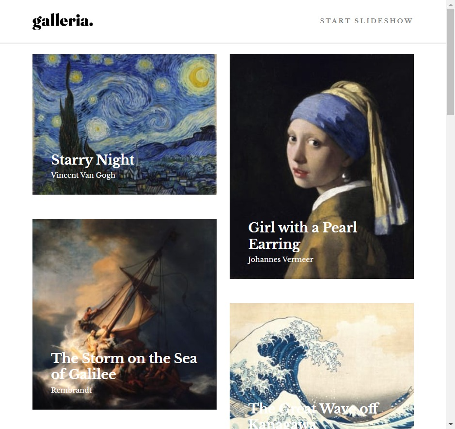
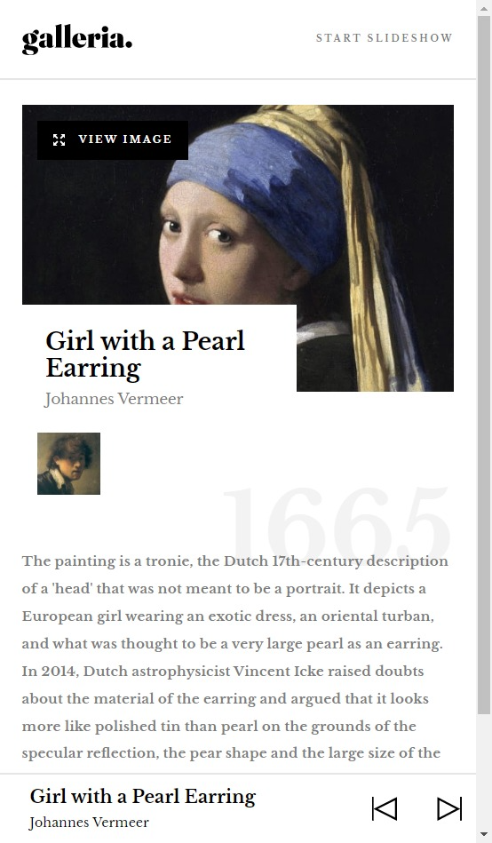
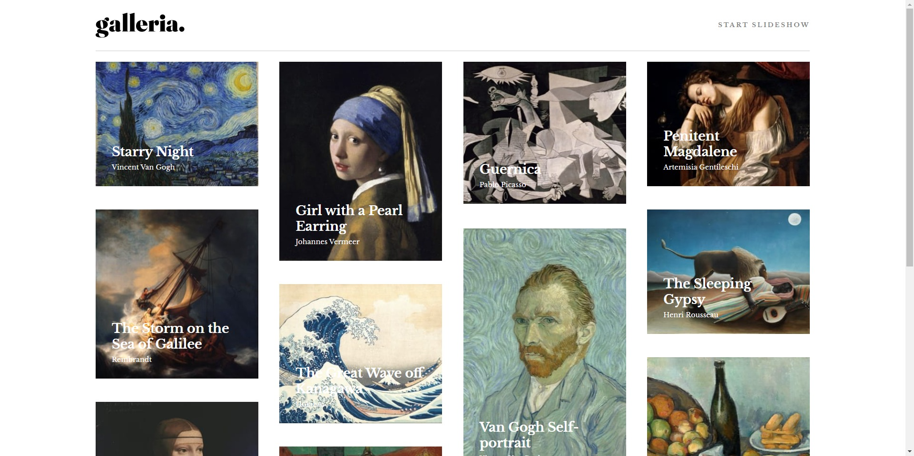
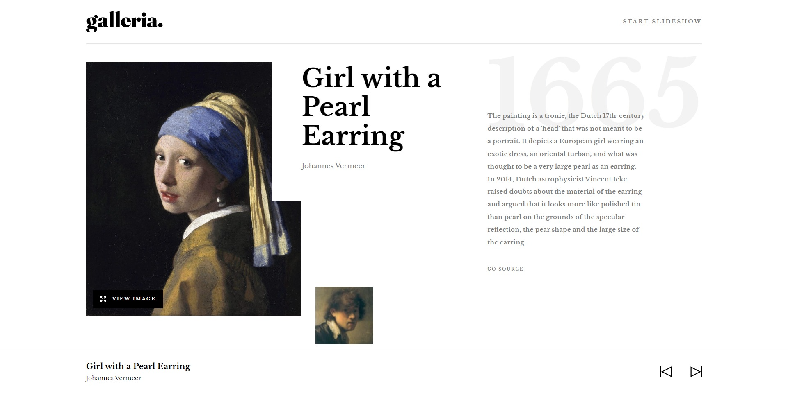

# Frontend Mentor - Galleria slideshow site solution

This is a solution to the [Galleria slideshow site challenge on Frontend Mentor](https://www.frontendmentor.io/challenges/galleria-slideshow-site-tEA4pwsa6). Frontend Mentor challenges help you improve your coding skills by building realistic projects.

## Table of contents

- [Overview](#overview)
  - [The challenge](#the-challenge)
  - [Screenshot](#screenshot)
  - [Links](#links)
- [My process](#my-process)
  - [Built with](#built-with)
  - [What I learned](#what-i-learned)
  - [Useful resources](#useful-resources)
- [Author](#author)

## Overview

### The challenge

Users should be able to:

- View the optimal layout for the app depending on their device's screen size
- See hover states for all interactive elements on the page
- Navigate the slideshow and view each painting in a lightbox

### Screenshot

### Links
- Live Site URL: [Galleria](https://galleria-64563.firebaseapp.com/)

## My process

### Built with

- Semantic HTML5 markup
- CSS custom properties
- Flexbox
- CSS Grid
- Mobile-first workflow
- [React](https://reactjs.org/) - JS library
- [Next.js](https://nextjs.org/) - React framework
- [Styled Components](https://styled-components.com/) - For styles
- [Redux](https://redux-toolkit.js.org/) - For state management

### What I learned

Complex global state management and responsive styling.

### Useful resources

- [Redux Toolkit Course Code Evolution](https://www.youtube.com/playlist?list=PLC3y8-rFHvwiaOAuTtVXittwybYIorRB3) - Taught me the fundamentals of redux and its implementation.

## Author

- Email - <atolini@live.com>
- LinkedIn - [Lucas Atolini](https://www.linkedin.com/in/lucas-atolini-869879221/)

